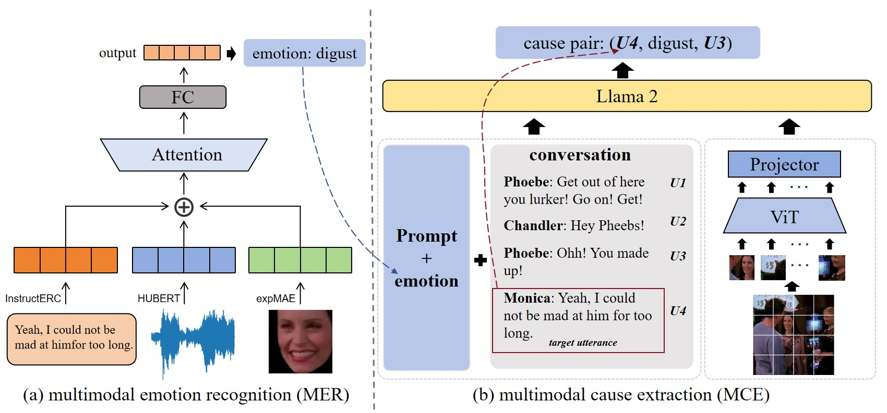

# Code of MIPS at SemEval-2024 Task 3  

## Introduction  

This paper presents a winning submission to Subtask 2 of SemEval 2024 Task 3, concentrating on multimodal emotion cause analysis in conversations. We propose a two-step architecture for multimodal emotion recognition and multimodal emotion cause extraction, our study delves into the efficacy of integrating supplementary modalities alongside textual data to bolster comprehension of emotions and discern their underlying triggers. Through experimental evaluation, our team elucidates the advantages conferred by the inclusion of diverse modalities, thereby amplifying the models' capacity for emotion understanding and causality inference. Ultimately, our submission for Subtask 2 of SemEval-2024 Task 3 attains a weighted F1 score of 0.3435, ranking third.

## Pipeline


## Setup
### Prepare the code and the environment

```
git clone https://github.com/MIPS-COLT/MER-MCE.git
cd MER-MCE
conda env create -f environment.yaml
conda activate minigptv
```  

### Prepare the pretrained LLM weights
Download the Llama-2-7b-chat-hf model from Huggingface to "MER-MCE/checkpoints/"  
```
https://huggingface.co/meta-llama/Llama-2-7b-chat-hf
```

### Prepare the pretrained model checkpoints
Download the pre-trained emotion cause analysis model on the ECAC dataset and place it in the folder named "MER-MCE/checkpoints/save_checkpoint".
```
Google Drive:
https://drive.google.com/drive/folders/1N72VyvtxdPouAPnT5fjntjXOXLBav-wi?usp=sharing

Baidu Netdisk:
https://pan.baidu.com/s/1qB00ZKyK0wIkECaisqElxw 
Extraction Code: 2pmk
```

## Run
Run the following code to extract emotional cause:  

```
torchrun  --nproc_per_node 1 eval_ECAC_cause.py --cfg-path eval_configs/minigptv2_eval_ECAC_emotion.yaml

python submit_emotion-cause_pair.py
```
Save the final submission result of Subtask 2 as "results/submit_all_cause_ck6_wd5_now-n_w-e.json" (w-avg.F1=0.3435)


If you're using MER-MCE in your research or applications, please cite using this BibTeX:
```bibtex
@misc{cheng2024mips,
      title={MIPS at SemEval-2024 Task 3: Multimodal Emotion-Cause Pair Extraction in Conversations with Multimodal Language Models}, 
      author={Zebang Cheng and Fuqiang Niu and Yuxiang Lin and Zhi-Qi Cheng and Bowen Zhang and Xiaojiang Peng},
      year={2024},
      eprint={2404.00511},
      archivePrefix={arXiv},
      primaryClass={cs.CL}
}
